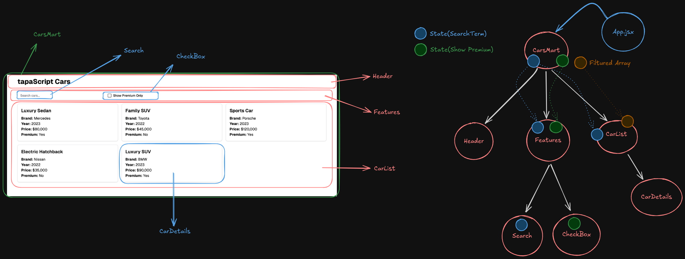
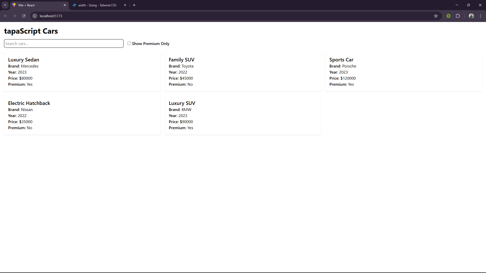
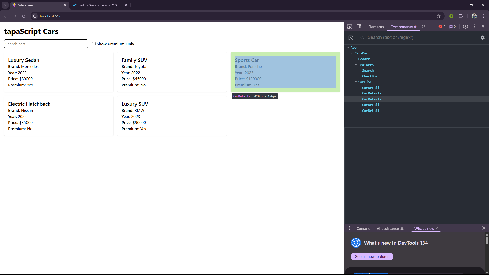

# tapaScript Cars

tapaScript Cars is a React-based application that allows users to search for cars and filter premium cars using a checkbox. The project is built with **React** and **TailwindCSS** and adheres to best practices, ensuring no ESLint errors or console warnings.

## 📂 Features

- Search for cars by name.
- Filter premium cars using a checkbox.
- Responsive design styled with TailwindCSS.
- Clean and well-structured code with no ESLint suppressions or console errors.

## 📦 Installation & Running the Project

To run this project locally, follow these steps:

1. Clone the repository:
   ```sh
   git clone https://github.com/jihad-islam/React-Car-Project-Updated.git
   ```
2. Navigate to the project directory:
   ```sh
   cd React-Car-Project-Updated
   ```
3. Install dependencies:
   ```sh
   yarn
   ```
4. Start the development server:
   ```sh
   yarn dev
   ```

## 📷 Screenshots

### Component Hierarchy Diagram

Below is the component hierarchy diagram for the project:



### UX Design Diagram



### React Dev Tools Screenshot



## 🚀 Deployment and GitHub Repository Link

The project is deployed and accessible at the following link:

[Live Demo on Vercel](https://react-car-project-gamma.vercel.app/)

You can also find the source code on GitHub:

[GitHub Repository](https://github.com/jihad-islam/React-Car-Project-Updated.git)

## 🛠️ State and Props

### Identified States:

- `searchTerm`: Tracks the search input value.
- `showPremium`: Tracks whether the "Show Premium Only" checkbox is checked.

### Identified Props:

- `searchTerm` (passed to `Search` component).
- `onSearchCar` (callback to update `searchTerm`).
- `onTogglePremium` (callback to update `showPremium`).
- `cars` (passed to `CarList` component to display filtered cars).

## 🧹 Code Quality

- The code is well-formatted and adheres to ESLint rules.
- No ESLint suppressions or errors.
- No console warnings or errors.

## 🛠️ Tools and Technologies

- **React**: For building the UI components.
- **TailwindCSS**: For styling the application.
- **Vite**: For fast development and build tooling.
- **ESLint**: For maintaining code quality.

---

Feel free to contribute or report issues in the GitHub repository. Happy coding!
